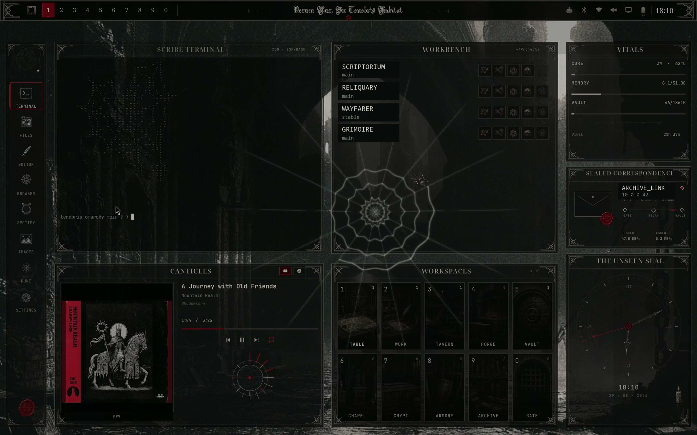

# TENEBRIS Dungeon Master

**Turn your Omarchy into a living gothic dungeon.**

TENEBRIS Dungeon Master turns Omarchy into a handcrafted dark-fantasy
workstation. Workspace 1 becomes the **Black Archive**: a fixed terminal,
project workbench, system vitals, media controls, ten illustrated rooms and an
idle spider-web scene. Workspaces 2–10 stay available for normal use.

[](media/tenebris-preview.mp4)

[▶ Watch the TENEBRIS showcase with desktop audio](media/tenebris-preview.mp4)

The rice also includes a custom top bar and Omarchy menu, a matching lock
screen, wallpapers, GTK styling, terminal colors, Obsidian colors and optional
music integrations. Hardware settings are left untouched unless a display
profile is explicitly selected during installation.

> [!WARNING]
> **TENEBRIS is experimental.** The installer backs up every user configuration
> file it replaces and `./uninstall.sh` can restore the previous desktop state.
> Even so, keep your own backup of `~/.config` and any important personal files
> before installing, just in case.

## Requirements

- Omarchy Quattro (4.x); other Omarchy generations are rejected before any
  package or user configuration is changed
- An active Hyprland/Omarchy desktop session
- Internet access and `sudo` for missing packages

A fresh Omarchy Quattro user profile is supported. TENEBRIS creates its own
missing user directories, including the default `~/Projects` Workbench root,
and installs missing runtime packages. It never installs, upgrades or replaces
Omarchy itself.

The installer uses Omarchy's package helper to install these runtime packages
when needed:

`quickshell-git`, `cava`, `jq`, `playerctl`, `tmux`, `xdg-terminal-exec`,
`noto-fonts`, `nautilus`, `btop`, `xdg-user-dirs`, `git` and `curl`.

Most already ship with Omarchy. TENEBRIS works with the terminal selected in
Omarchy; Foot and Alacritty receive dedicated dashboard profiles.
`cava` drives the 16-band music sigil through PipeWire; if audio capture is
unavailable, the dashboard falls back to its static sigil without a restart
loop.

## Reference setup

TENEBRIS was designed and visually tuned on this setup:

- 2560×1600 (16:10) display at 240 Hz
- Hyprland scale `1.6`
- Omarchy Quattro 4.x
- Turkish and US keyboard layouts (`tr,us`)

The dashboard terminal placement has also been checked at 1280×720,
1366×768, 2560×1440 and 3440×1440. The reference layout remains the setup
above; different aspect ratios, display scales, font metrics or custom panels
may need small adjustments. The installer always preserves keyboard settings
and preserves the existing monitor mode by default.

### Display adjustments

If the terminal or a dashboard panel does not fit your resolution, edit the
repository source and run the installer again:

- Dashboard panel proportions: [`Dashboard.qml`](config/quickshell/tenebris-shell/Dashboard.qml)
- Terminal frame artwork: [`TerminalFrameOverlay.qml`](config/quickshell/tenebris-shell/TerminalFrameOverlay.qml)
- Native terminal position and size: [`place-dashboard-terminal.py`](config/quickshell/tenebris-shell/place-dashboard-terminal.py)
- Terminal padding and opacity: [`foot-dashboard.ini`](config/quickshell/tenebris-shell/foot-dashboard.ini)
  or [`alacritty-dashboard.toml`](config/quickshell/tenebris-shell/alacritty-dashboard.toml)

Keep the frame width, height and offsets in the QML files synchronized with
the matching calculations in `place-dashboard-terminal.py`; otherwise the
terminal surface and carved frame will drift apart. Files under
`~/.config/quickshell/tenebris-shell` are deployed copies and are overwritten
by the next install.

## Install

```bash
git clone https://github.com/executionreverted/omarchy-tenebris-dm.git
cd omarchy-tenebris-dm
./install.sh
```

Interactive installs list every connected output's supported resolution and
refresh-rate combinations. **Keep current settings** is the default. The
selected profile preserves that output's existing scale, position and
transform, and is removed again by `./uninstall.sh`.

The installer then asks about each music client separately. YMC and cliamp are
recommended; spotify-tui is optional. No client is installed without its own
answer. Scripted installs can make the same choice explicitly:

```bash
./install.sh --music-clients recommended
./install.sh --music-clients ymc,cliamp,spotify-tui
```

For a scripted installation, the same choice can be supplied explicitly:

```bash
./install.sh --display-output eDP-1 --display-mode 2560x1600@240.00
```

Use `./install.sh --skip-packages` if the dependencies are already managed by
you. The installer validates the repository, backs up every replaced user file,
applies the theme and opens workspace 1. Re-running it updates the rice while
keeping your dashboard settings.

It installs or updates:

- `~/.config/quickshell/tenebris-shell`
- `~/.config/omarchy/themes/tenebris`
- `~/.config/omarchy/plugins/tenebris.menu`
- marked TENEBRIS blocks in Hyprland and GTK user configuration
- the synced Omarchy theme in existing Obsidian vaults
- optional player themes/services only when their clients are present

Backups and restore state live in `~/.local/state/tenebris-omarchy/`.

## Optional integrations

TENEBRIS can install and theme these applications when selected:

- [`spotify-tui`](https://github.com/Rigellute/spotify-tui) (`spt`) for the
  Spotify dock entry
- [`youtube-music-cli`](https://github.com/involvex/youtube-music-cli) (`ymc`)
  for the native music overlay
- `cliamp` for the alternate persistent terminal player
- VS Code (`code`) and Codex for Workbench actions

Without them, the desktop remains functional and the related actions stay
inactive. YMC is installed from its checksum-verified official GitHub release
with `mpv` and `yt-dlp`; cliamp comes from Omarchy's package repository;
spotify-tui uses its checksum-verified official release. TENEBRIS never logs
into an account for you and does not overwrite client credentials.

The **Argor Flahm Scaqh** title font is bundled and installed automatically, so
the dashboard uses its intended typography immediately after installation.

## Customize

Web density, wind, motion, frame rate and idle timing are stored in:

```text
~/.config/quickshell/tenebris-shell/settings.json
```

The Workbench reads every direct subfolder from `~/Projects` by default. Click
the folder path in its header to choose another directory under your home
folder; the adjacent sort icon offers name A–Z, name Z–A, newest-modified and
oldest-modified order. The list is scrollable and its Git metadata is cached so
large project folders do not stall the dashboard.

The dashboard terminal artwork is plain text and can be edited at:

```text
~/.config/quickshell/tenebris-shell/dashboard-art.txt
```

Right-click the Black Archive seal to open the web controls. Use Omarchy's
usual wallpaper shortcut to rotate the two included backgrounds.

The shipped **Web of Silence** profile uses density `0.95`, wind `1.75`,
motion `2.0`, 30 FPS at `0.75×` render scale, a 90-second idle delay and a
30-second weave. Existing settings remain untouched when TENEBRIS is updated.

## Uninstall

```bash
./uninstall.sh
```

The uninstaller restores the previous theme, menu, stock-bar state, GTK blocks,
player configuration and service state. It asks separately whether YMC,
cliamp and spotify-tui should also be removed when detected; the default is to
keep each one. Music login, library and credential data are always preserved.
Removed TENEBRIS files and local player binaries are retained in the state
directory for recovery. Core runtime packages are intentionally kept.

## License

Code and documentation are released under the [MIT License](LICENSE). The
bundled artwork may be used as part of TENEBRIS; see the artwork note in the
license.

**Font credit:** *Argor Flahm Scaqh* was created by JP Mallaroni. Respect to the
original scribe; the author's bundled usage notice is preserved in
[`assets/fonts/Argor.txt`](assets/fonts/Argor.txt).
